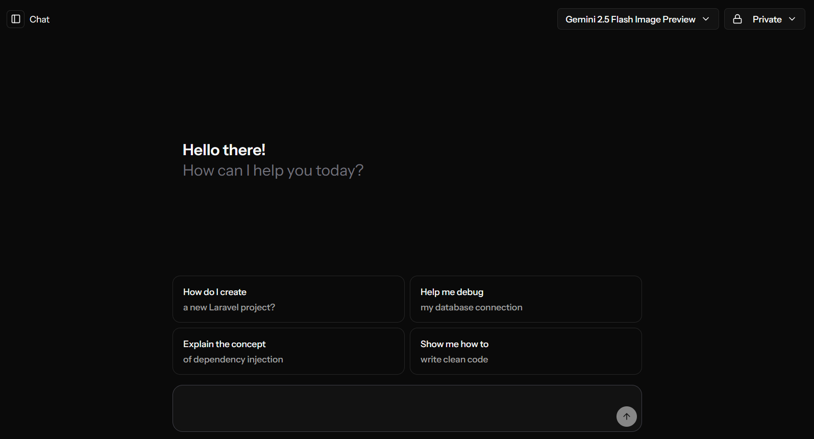
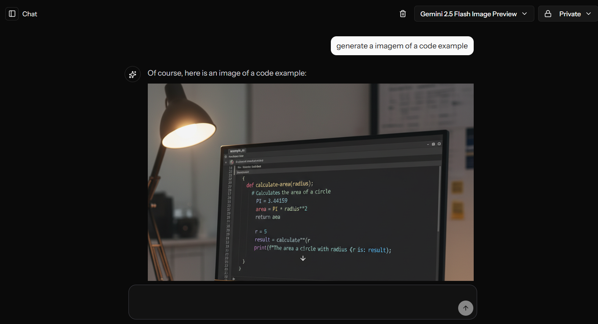

# My AI Chat

Um projeto de exemplo de um aplicativo de chat construído com Laravel, Vue.js e Inertia.js, utilizando a API do Gemini para a funcionalidade de chat de IA.

## Screenshots

| Chat | Image Generate |
| :---: | :---: |
|  |  |

## Recursos

- **Chat em tempo real:** Streaming de respostas diretamente da API do Gemini.
- **Interface Reativa:** Construído como um Single Page Application (SPA) com Vue.js e Inertia.js.
- **Backend Robusto:** Utiliza o poder do Laravel para gerenciamento de rotas, autenticação e dados.
- **Design Moderno:** Estilizado com Tailwind CSS.
- **Autenticação de Usuários:** Sistema completo de login, registro e gerenciamento de perfil.

## Tecnologias Utilizadas

- **Backend:**
  - [Laravel](https://laravel.com/)
  - [PHP](https://www.php.net/)
- **Frontend:**
  - [Vue.js](https://vuejs.org/)
  - [Inertia.js](https://inertiajs.com/)
  - [TypeScript](https://www.typescriptlang.org/)
  - [Tailwind CSS](https://tailwindcss.com/)
  - [Vite](https://vitejs.dev/)
- **Database:**
  - SQLite (padrão, configurável em `.env`)

## Pré-requisitos

- PHP >= 8.2
- Composer
- Node.js
- Npm

## Instalação

1. **Clone o repositório:**
   ```bash
   git clone https://github.com/seu-usuario/my-ai-chat.git
   cd my-ai-chat
   ```

2. **Instale as dependências do PHP:**
   ```bash
   composer install
   ```

3. **Instale as dependências do Node.js:**
   ```bash
   npm install
   ```

4. **Configure o ambiente:**
   - Copie o arquivo de ambiente de exemplo:
     ```bash
     cp .env.example .env
     ```
   - Gere a chave da aplicação:
     ```bash
     php artisan key:generate
     ```
   - Adicione sua chave da API do Gemini no arquivo `.env`:
     ```
     GEMINI_API_KEY=sua_chave_aqui
     ```

5. **Execute as migrações e seeders do banco de dados:**
   ```bash
   php artisan migrate --seed
   ```

6. **Crie o link simbólico para o storage:**
    ```bash
    php artisan storage:link
    ```

## Executando a Aplicação

1. **Inicie o servidor de desenvolvimento do Vite:**
   ```bash
   composer run dev
   ```

Acesse a aplicação em [http://localhost:8000](http://localhost:8000).

## Licença

Este projeto está sob a licença MIT. Veja o arquivo [LICENSE](LICENSE) para mais detalhes.
